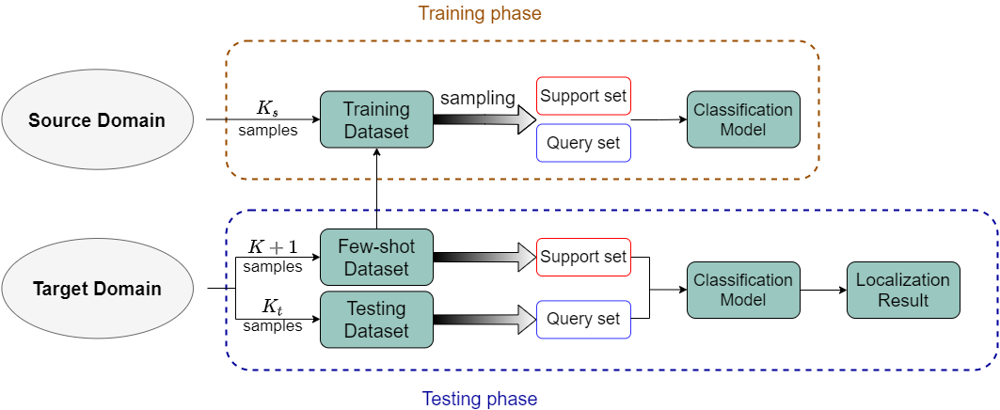
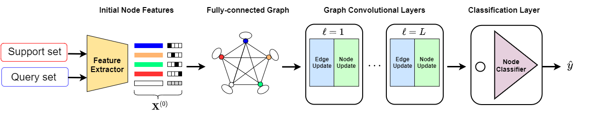

#  Few-Shot Transfer Learning for Device-Free Fingerprinting Indoor Localization

## Introduction:
This is implementation of few-shot learning based on graph neural network (GNN) for device-free CSI indoor localization. The main idea is using few-shot learning to transfer the localizing system to different domain with only few data.

This code is for paper : 
B.-J. Chen and R. Y. Chang, "Few-Shot Transfer Learning for Device-Free Fingerprinting Indoor Localization," IEEE International Conference on Communications (ICC), May 2022.

The structure of code is based on :
- https://github.com/louis2889184/gnn_few_shot_cifar100
- https://github.com/hazdzz/ChebyNet
- https://github.com/sadbb/few-shot-fgnn

## Dataset:
precollected CSI data from two different scenarios.

## Conception:
### system setup

### model structure

## Execution:
Train for GNN with k-shot

`python main.py --model GNN --shot k` 

Train for Attentive GNN with k-shot and beta = n (0.7)

`python main.py --model Attentive_GNN --shot k --beta n` 

Train for EGNN with k-shot and reg = n (0.01)

`python main.py --model EGNN --shot k --reg n`

Train for ChebyNet with k-shot and Kg = n (3)

`python main.py --model ChebyNet --shot k --Kg n`

Where the value in brackets is default.

If you are unable to use GPU, please use argument --device cpu

Otherwise, the argument --source_path and --target_path can design the path of source domain and target domain data, respectively.

## Experiement Result:

### Case I
|                                |       18-way 1-shot      |      18-way 5-shot      |      18-way 10-shot     |
|              :---:             |       :---:       |       :---:       |       :---:       |
| **CNN**                        | 27.37% | 53.07% | 69.61% |
| **GNN**                        | 37.51% | 66.70% | 85.25% | 
| **Attentive_GNN**              | 44.17% | 72.05% | 85.23% | 
| **EGNN**                       | 49.47% | 72.16% | 87.33% |
| **ChebyNet**                   | 47.19% | 74.75% | 85.55% | 

### Case II
|                                |       16-way 1-shot      |      16-way 5-shot      |      16-way 10-shot     |
|              :---:             |       :---:       |       :---:       |       :---:       |
| **CNN**                        | 29.00% | 51.47% | 72.59% |
| **GNN**                        | 63.14% | 72.11% | 87.78% | 
| **Attentive_GNN**              | 70.69% | 84.16% | 89.45% | 
| **EGNN**                       | 66.75% | 87.23% | 90.44% |
| **ChebyNet**                   | 73.69% | 85.42% | 88.52% | 

## Dependencies:

- python==3.9.7
- torch==1.9.0+cu102
- numpy==1.21.1
- sklearn==0.24.2

## Contact:
Bing-Jia Chen, b07901088@ntu.edu.tw
